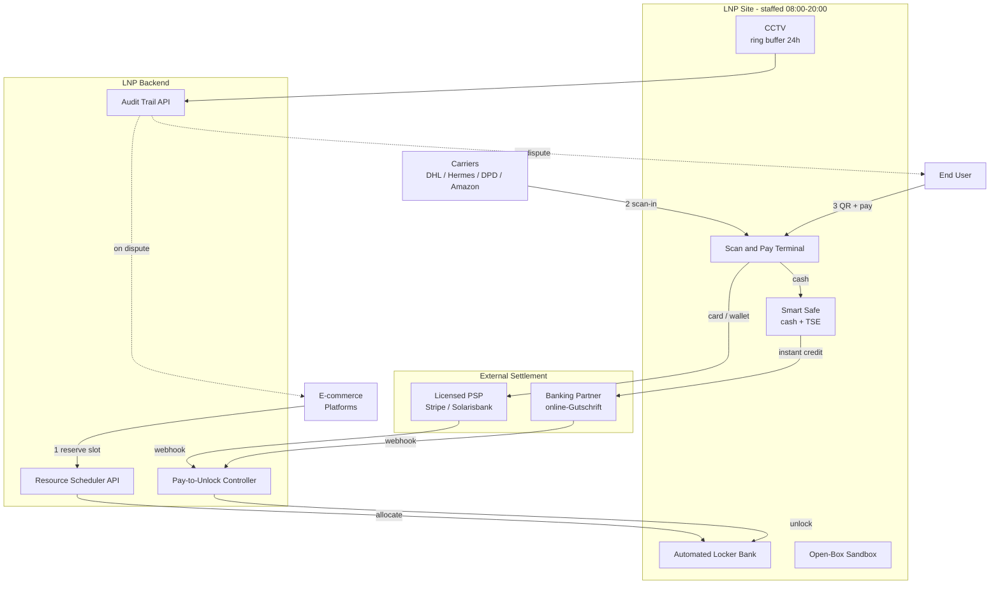
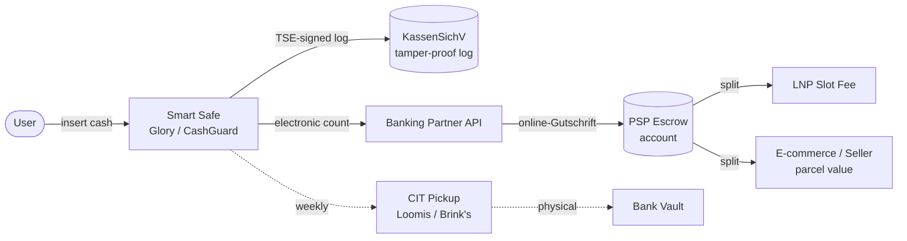
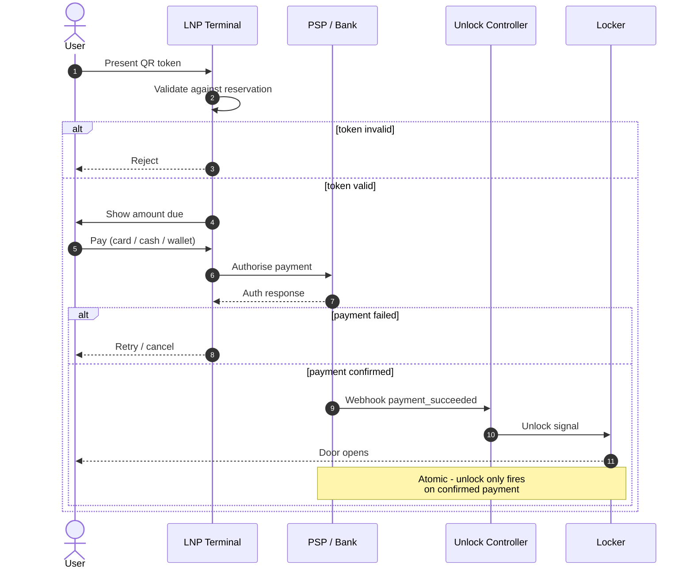

# LockerNodes Protocol (LNP)

> A carrier-neutral, API-driven physical handover protocol for urban last-mile parcel delivery.

**Status:** Concept — architecture exploration. No reference implementation yet.
**License:** MIT (see `LICENSE`)
**Pilot interest:** Berlin

---

## 1. Service Specification

LNP defines a contract between **carriers**, **e-commerce platforms**, and **end users** for predictable physical handover of parcels in dense urban environments. The thesis: treat physical hub space the way IaaS treats compute — reservable, billable per unit time, atomically settled.

### Designed for

- Last-mile parcel delivery in cities where doorstep delivery is unreliable (walk-up Altbau without elevators, no doorman, business-hour mismatch)
- Multi-carrier sharing of a single physical handover node (DHL, Hermes, DPD, Amazon Logistics, regional carriers — same locker bank)
- Atomic, settlement-coupled pickup (locker physically unlocks only when payment is confirmed by a licensed PSP)
- Bounded, evidence-backed dispute chains via timestamped audit recording

### NOT designed for

- Long-term storage / mini-warehousing (hard cap: 7 days retention)
- Internal-content quality verification — LNP records, does not adjudicate
- Cold-chain, hazmat, firearms, controlled substances
- Anonymous P2P transfer — every handover is bound to either a carrier waybill or a verified user QR token
- Parcel insurance — carriers and platforms remain liable for insured value
- Acting as a deposit-taking or payment-service institution — all client funds flow through licensed PSP partners (see § 2.C)

---

## 2. Architecture



### A. Physical Layer

- **Two-shift staffed operation** 08:00–20:00. Staff handle exception cases (oversized parcels, hardware faults, bulk drop-off receipt) and floor maintenance. Staff do not handle cash or cards.
- **Multi-angle CCTV** covering: driver entry, scan terminal, locker bank, in-store open-box area, exit. Footage retention is event-triggered (see § 5).
- **Sandbox open-box area** — monitored zone where users may inspect parcels before leaving the premises. Footage is automatically clipped for both parties on request.
- **Cardboard processing** — in-store recycling and compaction so the open-box area stays clean.

### B. Digital Layer

- **Resource Scheduler API** — at checkout, e-commerce can query and reserve a slot at a specific station, time window, and size class. Reservation success is required before the carrier waybill commits to LNP delivery.
- **Pay-to-Unlock** — physical unlock signal is strongly coupled to PSP payment confirmation. No payment, no door.
- **Audit Trail API** — on dispute trigger, both parties may request a packaged, timestamped, multi-angle video clip covering arrival → in-locker → pickup → optional in-store open-box.

### C. Settlement Layer

- **No client funds held by LNP.** All payment flows (cash-on-delivery, card, mobile wallet) are processed via licensed PSP partners (e.g. Stripe / Mollie / Adyen / Solarisbank BaaS). LNP receives only its own slot fee and overdue penalty.
- **Cash payment** is accepted only via certified smart-safe modules (TSE-compliant per KassenSichV) integrated with a banking partner's online-Gutschrift facility. Physical cash custody transfers to the banking partner at the moment of deposit; LNP staff never handle cash, and CIT (cash-in-transit) pickup is managed by the banking partner.
- **Cash transaction cap** — €999 per parcel for cash-on-delivery, to stay below GwG (Geldwäschegesetz / Anti-Money-Laundering Act) § 10 identity-verification thresholds. Higher-value parcels require card or mobile-wallet payment.



- **Progressive pricing** (per reservation, per slot):

  ```
  C(t) = B·t + S · (t-1)·t / 2     where t ∈ [1, 7] days
  ```

  `B` = base daily slot rent, `S` = congestion surcharge. The quadratic shape internalises the opportunity cost of long occupancy.

- **Early-pickup rebate** — if the parcel is picked up before the reserved window ends, unused time is refunded pro-rata to the reserving party. The freed slot is released back to the API for re-reservation.
- **Late-pickup penalty** — beyond the reserved window, surcharge accrues against the reserving party (e-commerce or P2P seller), never the end user directly.
- **Maximum retention** — 7 days. After day 7, the parcel enters reverse logistics and is returned to the carrier.

---

## 3. Operating Protocol

### Inbound (carrier handover)

1. Driver must physically enter the monitored zone.
2. Driver must scan the parcel waybill against the LNP terminal.
3. **Without a successful scan, the parcel is not received.** No record is created, no liability transfers. Staff politely refuse.
4. Staff perform external-only visual inspection. No internal inspection. If the outer package is visibly damaged, the parcel is logged as `damaged-on-arrival` and the carrier may withdraw or accept the flag.
5. On successful scan + intact outer package, the parcel is loaded into a slot whose ID is randomly assigned — staff terminals show only `LockerSize` and `SlotID`, never recipient name, sender, or contents (blind loading).

### Outbound (user pickup)

1. User presents the QR token issued by the e-commerce / seller app at the terminal.
2. Terminal validates the token against the reservation record.
3. PSP-mediated payment occurs (if cash-on-delivery or P2P escrow).
4. On payment confirmation, the locker unlocks. **This is atomic** — payment success is the sole and necessary trigger for physical unlock.
5. User may use the in-store open-box area. All activity is recorded.
6. **Once the user crosses the storefront threshold, the transaction is final.** Re-entry to claim post-hoc disputes is out of scope.



### Dispute handling

- LNP provides timestamped, multi-angle video on request to either party.
- LNP does **not** arbitrate content authenticity, value, condition, or item identity.
- E-commerce platforms, P2P sellers, and end users resolve content disputes through their own channels — credit-card chargeback, platform mediation, civil claim — using LNP-provided footage as evidence.
- LNP's responsibility chain ends at: (a) outer-package integrity at scan-in, (b) chain-of-custody recording while the parcel is on premises, (c) atomic unlock on confirmed payment.

---

## 4. Anti-Fraud (Internal)

LNP staff are the primary insider-threat surface. The protocol assumes any staff member could attempt to identify and steal high-value contents (e.g. an iPhone launch shipment). Mitigations:

- **Blind loading** — staff terminals never show contents, sender, recipient, or value
- **Random slot assignment** — no targeted theft path
- **Per-slot weight sensing** — weight delta between door-close and door-open events flags tampering
- **Handling-time monitoring** — extended in-hand duration during inbound triggers a supervisor review marker
- **Two-person rule for high-value windows** — during flagged launch windows (e.g. major SKU release dates), inbound operations require both shift staff present in frame
- **Tamper-evident handling** — outer-package photo at scan-in becomes the reference for any later dispute

---

## 5. Privacy & GDPR Posture

- CCTV uses ring-overwrite buffer mode. **Footage is not persisted by default.**
- Event-triggered clips (dispute request, anomaly flag, weight mismatch) are extracted and persisted for **maximum 7 days**, then auto-deleted.
- Ambient buffer retention: **24 hours** rolling.
- A DPIA (Data Protection Impact Assessment) is required before any pilot deployment.
- Lawful basis: GDPR Art 6(1)(f) legitimate interest, with explicit on-site signage and a documented balancing test.
- Staff CCTV scope is subject to BetrVG § 87 — works council agreement required where applicable.
- Data subject access requests handled per Art 15 with a 30-day response SLA.

---

## 6. Prior Art and Differentiation

LNP's individual building blocks are not novel — each has been deployed at scale somewhere. The thesis is that the specific *combination*, in Germany, is an unfilled niche.

### Closest networks

| Network | Carrier-neutral | API reservation | Atomic Pay-to-Unlock | Dedicated staff | Status |
|---|---|---|---|---|---|
| DHL Packstation (DE) | DHL-only | None | No | None | ~13k DE; market default |
| Hermes ParcelShop (DE) | Hermes-only | None | Manual COD | Host-shop | ~17k DE; quality variable |
| Amazon Hub Counter (DE) | Amazon-only | Yes | No | Host-shop | ~10k DE |
| InPost (PL &rarr; DE) | Partial (third-party API) | Yes | COD only | None | ~25k PL; ~7k DE rollout 2024&ndash;26 |
| Doddle (UK) | Yes | Yes | No | Full-time dedicated | Pivoted to SaaS in 2020 after consumer P&amp;L failed |
| Hive Box / 丰巢 (CN) | Limited | Yes | Yes (some hubs) | Hybrid concierge | 2024 IPO; loss-making for years |
| **LNP** (proposed) | Yes | Yes | Yes | Yes (two-shift) | Concept stage |

### Combination not yet deployed in Germany

- **Atomic Pay-to-Unlock + carrier-neutral + dedicated staffed hub + KassenSichV / GwG-compliant cash handling** — no single existing network combines all four.
- **Sandbox open-box area with explicit storefront-threshold finality SOP** — most staffed networks blur this line, which inflates dispute-handling cost.
- **Audit-footage-as-evidence with no LNP arbitration** — see §§ 3 (Dispute handling) and 5.
- **P2P resale escrow** (e.g. Kleinanzeigen, Vinted) as a first-class use case rather than an afterthought.

### Honest caveats

- **Doddle's 2020 pivot is the most informative cautionary precedent.** £90M+ in funding, exclusive UK rail-station footprint, and still could not make dedicated-staffed consumer P&amp;L work. Any LNP business plan that does not engage with Doddle's failure modes is incomplete.
- **InPost's DE rollout** (≈7,000 lockers by 2025–26) creates negative network-effect pressure on any staffed entrant arriving after them.
- **Capital intensity** — staffed hubs with smart safes, automated lockers, and CCTV require substantially more per-site capex than InPost's unmanned model. Single-store unit economics must be validated before scaling.

---

## 7. Status & Roadmap

This repository documents a thesis. **No code, no API, no operating site exists yet.** The next milestones, in order:

- [ ] German legal opinion: GDPR (BlnBDI guidance), BetrVG, AGB skeleton
- [ ] PSP partner LOI for settlement layer
- [ ] Reference API specification (`API_SPEC.md`)
- [ ] First pilot-site MOU (Berlin, target neighbourhood TBD)
- [ ] 90-day manual pilot — single staffed location, no automated lockers, validate unit economics
- [ ] Reference implementation (open-source)

---

## 8. License

MIT. See `LICENSE`.

The protocol specification itself is open; reference implementations released under this repository are open source.

---

## 9. Engagement

If you are:

- An **e-commerce platform** considering atomic-settlement pickup as an alternative to retry-based delivery
- A **carrier** evaluating shared-infrastructure economics
- A **PSP** open to a physical-settlement-terminal integration
- A **researcher** working on physical-digital handover protocols

Open a GitHub Issue or reach out via the contact listed on the repository profile.

Critical review is especially welcome — see § 7, this is a thesis, not a product.
